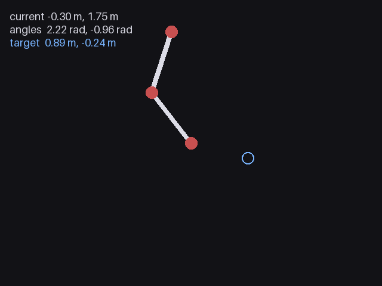

# kine

An interactive two-joint inverse-kinematics simulator with smooth motion and a live WebRTC video feed.

[Demo app](https://laroccacharly-dev--kine-frontend.us-east.modal.direct) <!-- demo-app-url -->



## Features

- Forward and inverse kinematics powered by CasADi and IPOPT
- Configurable targets, speed, acceleration, and settling behavior
- Real-time rendered arm animation streamed to a responsive web interface
- FastAPI backend, React frontend, and Modal deployment

## Run locally

Requires Python 3.12+, [uv](https://docs.astral.sh/uv/), and [Bun](https://bun.sh/).

```console
uv sync
uv run serve
```

Open [http://127.0.0.1:8000](http://127.0.0.1:8000).

## Other commands

```console
uv run pytest
uv run lint
uv run deploy
uv run python scripts/render_readme_frame.py
```
